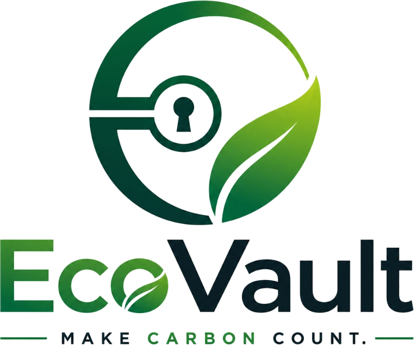

<div align="center">

  

  # EcoVault (इकोवॉल्ट)
  ### *Make Carbon Count.*

  **India's Trust-First Voluntary Carbon Credit & Escrow Marketplace**

  [](https://ecovault-nu.vercel.app)
  [](https://nextjs.org/)
  [](https://threejs.org/)
  [](https://www.typescriptlang.org/)
  [](https://tailwindcss.com/)

  <br />

  [Explore Live Prototype](https://ecovault-nu.vercel.app) • [View Marketplace](https://ecovault-nu.vercel.app/buyer/marketplace) • [Audit Protocol](https://ecovault-nu.vercel.app/verification)

</div>

---

## 🌿 Overview

**EcoVault** is a next-generation voluntary carbon credit exchange engineered specifically for the Indian climate economy. In traditional offset markets, project developers (forestry communities, biogas innovators, solar farms) lose up to 40% of their margins to intermediary brokers, while institutional buyers face severe greenwashing risks, lack of registry visibility, and double-selling liabilities.

EcoVault solves the carbon trust deficit by providing:
1. **Direct Escrow Settlement:** Capital is locked in institutional escrow vaults until registry ownership transition is cryptographically verified.
2. **Anti-Greenwashing Laser Verification Scanner:** Real-time query handshakes with the Grid Controller of India (GCI) and satellite density checks.
3. **Studio-Grade 3D Geospatial Visualization:** Real-time Three.js telemetry globe mapping verified credit origins from Sundarbans to Thar.

---

## ✨ Key Features & Architectural Modules

### 🌍 1. Interactive 3D Geospatial Globe (`GlobeComponent.tsx`)
- Studio-grade three-point lighting (Directional Key Light `2.6`, Emerald Rim Light `3.4`, and Deep Ambient Fill `0.4`).
- Real-time pinpoint telemetry across India's carbon corridors (Odisha Mangroves, Punjab Biogas, Thar Solar, Kutch Wind).
- Dynamic sonar ripple rings (`ringsData`) pulsing on active seller coordinates.
- Inertial orbit controls with smooth damping drag interaction.

### 🌊 2. Atlas Motion 3D WebGL Living Topography (`OrganicFlowBackground.tsx`)
- Continuous Three.js WebGL rendering layer that spans the entire page from Hero to Footer.
- **Volumetric 3D Lidar Topography Waves:** Multi-frequency sine and cosine harmonic contours that undulate in real-time.
- **Scroll-Velocity Camera Orbit:** 3D perspective camera tracks scroll velocity with fluid momentum, creating deep spatial parallax.
- **Floating Bio-Luminescent Particle Swarm:** 180 luminous carbon spores drifting with additive radial glow sprites.
- **Interactive Cursor Gravity:** Real-time 3D magnetic wave deflection based on mouse coordinates.

### 🔍 3. Anti-Greenwashing Laser Scanner Console
- Simulated real-time registry audit handshake executing 6 verification steps:
  1. Registry Socket Handshake
  2. eKYC Identity Validation
  3. GCI Registry Cross-Check
  4. Escrow Double-Spending Liquidity Check
  5. Satellite Lidar Biomass Density Pass
  6. Vault Custody Lock Validation
- Laser sweep animation with live monospace diagnostic logging.

### 🧪 4. Sensory Carbon Impact Explorer (`SensoryImpactShowcase.tsx`)
- Interactive project archetype switcher (Mahanadi Mangroves, Malwa Biogas, Thar Solar, Kutch Wind).
- Liquid background color transitions and ambient glow morphing.
- Live tree sequestration and flight offset metric calculators with tactile spring sliders.

### 💼 5. Dual-Persona Trading Workspaces
- **Buyer Portal (`/buyer/marketplace` & `/buyer/dashboard`):**
  - Search and filter projects by methodology, price, and ACVA verification.
  - Interactive purchase modal with instant certificate generation.
  - Portfolio tracking, ESG retirement ledger, and certificate verification badges.
- **Seller Portal (`/seller/onboard` & `/seller/dashboard`):**
  - Multi-step developer onboarding with eKYC and GCI registry matching.
  - New project creation wizard with AI Reference Price guidance.
  - Real-time bid management: accept or decline buyer offers with instant escrow payout release.

---

## 🛠️ Technology Stack

| Layer | Technology |
| :--- | :--- |
| **Framework** | [Next.js 16.3 (App Router & Turbopack)](https://nextjs.org/) |
| **Language** | [TypeScript 5](https://www.typescriptlang.org/) |
| **3D & WebGL Graphics** | [Three.js 0.185](https://threejs.org/) & [`react-globe.gl`](https://github.com/vasturiano/react-globe.gl) |
| **Motion & Physics** | [Framer Motion 13](https://www.framer.com/motion/) (Spring physics, Magnetic CTAs, 3D Tilt cards) |
| **Styling & Design System** | [Tailwind CSS v4](https://tailwindcss.com/) with custom glassmorphism and aurora tokens |
| **Icons & Assets** | [Lucide React](https://lucide.dev/) |
| **Hosting & CI/CD** | [Vercel Edge Network](https://vercel.com/) |

---

## 📂 Project Structure

```bash
EcoVault/
├── public/
│   ├── logo-clean.png           # Transparent brand logo & typography
│   ├── logo-emblem.png          # Cropped circular vault keyhole emblem
│   └── images/
├── src/
│   ├── app/
│   │   ├── layout.tsx           # Root layout with persistent 3D WebGL background
│   │   ├── page.tsx             # Interactive landing page
│   │   ├── globals.css          # Design system tokens, aurora mesh, typography
│   │   ├── about/page.tsx       # Mission, vision, core principles & creator profile
│   │   ├── verification/page.tsx# GCI verification protocol documentation
│   │   ├── buyer/
│   │   │   ├── marketplace/     # Escrow carbon listings & interactive filters
│   │   │   └── dashboard/       # Buyer portfolio, ESG goals & certificates
│   │   └── seller/
│   │       ├── onboard/         # Developer KYC & registry onboarding
│   │       ├── create/          # New credit listing wizard with AI pricing
│   │       └── dashboard/       # Custody vault, active bids & cash payouts
│   ├── components/
│   │   ├── GlobeComponent.tsx   # Three.js 3D studio-lit interactive Earth
│   │   ├── InteractiveGlobe.tsx # Dynamic client wrapper for 3D Globe
│   │   ├── OrganicFlowBackground.tsx # 3D WebGL Lidar topography & bio-spores
│   │   ├── SensoryImpactShowcase.tsx # Liquid color morphing impact cards
│   │   ├── MagneticButton.tsx   # Spring physics cursor-pull button
│   │   ├── TiltCard.tsx         # 3D perspective card with specular sheen
│   │   ├── Logo.tsx             # Vector emblem & wordmark component
│   │   ├── Navbar.tsx           # Navigation with persona switchers
│   │   └── Footer.tsx           # Footer with live status & author links
│   ├── context/
│   │   └── AppContext.tsx       # Global state for bids, transactions & portfolio
│   └── data/
│       └── mockProjects.ts      # Indian carbon offset projects data
├── package.json
└── README.md
```

---

## 🚀 Getting Started

### Prerequisites
- Node.js 18+ installed
- npm / pnpm / yarn

### Installation & Local Development

1. **Clone the repository:**
   ```bash
   git clone https://github.com/ManikBodamwad/EcoVault.git
   cd EcoVault
   ```

2. **Install dependencies:**
   ```bash
   npm install
   ```

3. **Start the local development server:**
   ```bash
   npm run dev
   ```

4. **Open the browser:**
   Navigate to [http://localhost:3000](http://localhost:3000) to view the application.

### Production Build
```bash
npm run build
npm run start
```

---

## 👨‍💻 Author & Attribution

**Designed & Developed by:**
* **Manik Bodamwad**
* 🌐 **LinkedIn:** [linkedin.com/in/manik-bodamwad-814b331a6](https://www.linkedin.com/in/manik-bodamwad-814b331a6/)
* 💻 **GitHub:** [github.com/ManikBodamwad](https://github.com/ManikBodamwad?tab=repositories)

---

## 📄 License

This project is open-source and available under the [MIT License](LICENSE).
